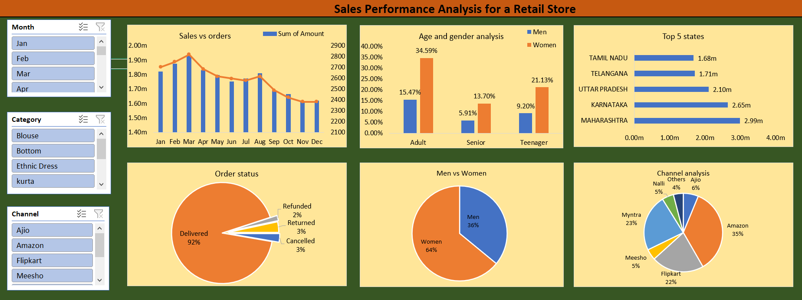

# Sales Performance Analysis for a Retail Store

## 🔍 Project Overview:
 In this project, I Have analyzed the sales data of a retail store to help them better understand their business performance. The goal is to provide insights that 
 can improve decision-making.

## Dashboard Preview

## Data Source

[Click here](./Sales_dataset.csv) to show the datasets

## 🛠️ Tools Used: Microsoft Excel
Utilized Excel for effective data analysis and strategic planning.

## 💡 Key Sales Insights:
- Seasonal Variation: March consistently leads in sales, while November records the lowest performance.

- Gender Impact: Women drive 64% of sales, dominating across demographics and product categories.

- Regional Disparities: Maharashtra leads with 2.99 million in sales; Tamil Nadu reports the lowest.

- Channel Performance: Amazon secures a dominant 35% market share, outperforming other channels.

## 🌐 Recommendations:
- ### Strategic March Campaigns:
  Execute targeted marketing campaigns in March to leverage peak sales trends.
- ### Empower Women in Marketing:
  Enhance marketing strategies for women across demographics and product lines.
- ### Invest in Maharashtra:
  Allocate resources strategically to capitalize on the robust market in Maharashtra.
- ### Diversify Product Range:
  Introduce new products tailored to men's preferences to achieve a more balanced gender impact.
- ### Optimize Amazon Presence:
  Strengthen visibility and sales on Amazon through effective optimization strategies.

