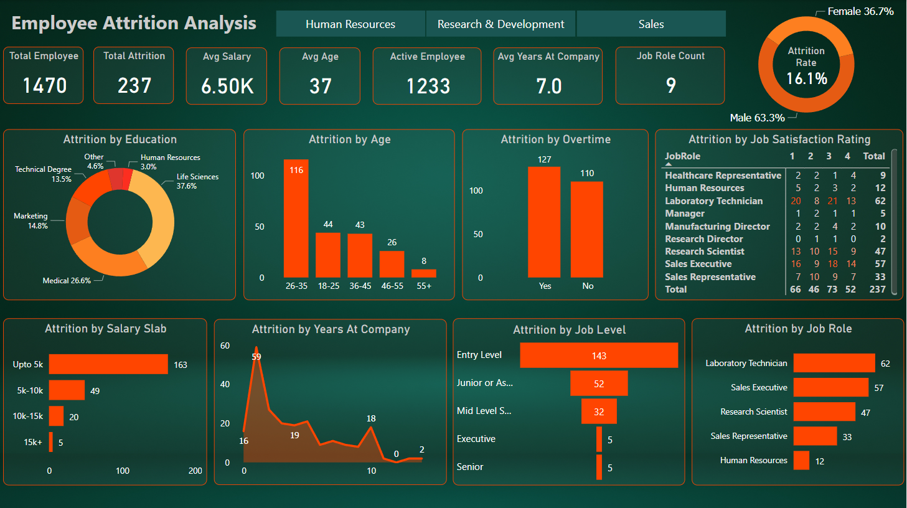

# Employee Attrition Analysis

## 🔍 Project Overview:
In this comprehensive project, my aim was to unravel employee attrition challenges at
Coding Samurai using the IBM HR Analytics Employee Attrition & Performance dataset. The analysis encompassed meticulous exploration, data cleaning, and preprocessing, setting the stage for robust insights.

## 🛠️ Tools Used: Power BI
The entire project was orchestrated using Power BI, a dynamic and intuitive business analytics tool. Its capabilities allowed me to create interactive visualizations, uncover patterns, and transform processed data into meaningful insights.

## 💡 Insights & Findings:

- Gender Breakdown: Attrition skewed with 150 males and 87 females.
- Education Field Impact: Life Science recorded the highest attrition.
- Age Group Dynamics: 26-35 age group experienced the highest attrition.
- Overtime Impact: Attrition patterns correlated with overtime.
- Job Satisfaction Impact: Attrition linked to varying job satisfaction levels.
- Salary Bracket Analysis: Significant attrition below $5,000 monthly income.
- First-Year Challenges: Noteworthy attrition in the first year of employment.
- Entry-Level Trends: Predominant attrition observed in entry-level roles.
- Job Role Specifics: Lab Technicians faced the highest attrition.

## 🌐 Recommendations:

+ Promote Work-Life Balance: Initiate policies supporting a healthier work-life balance, particularly regarding overtime.

+ Targeted Life Science Retention: Develop tailored retention initiatives for the Life Science field, addressing sector-specific challenges.

+ Engage 26-35 Age Group: Implement programs focusing on career growth and engagement for employees in the 26-35 age group.

+ Financial Wellness Initiatives: Introduce financial wellness programs to support employees earning below $5,000 monthly.

+ First-Year Support Programs: Enhance onboarding and support during the crucial first year to improve overall retention.

+ Career Advancement Focus: Create clear pathways for career growth, especially for entry-level positions.

+ Lab Technician Support: Investigate Lab Technician concerns and implement targeted strategies to improve their work experience.

## Dataset
I utilized the IBM HR Analytics Employee Attrition & Performance dataset, which is accessible on Kaggle under the title "IBM HR Analytics Dataset." [Click here](./HR-Employee-Attrition-Dataset.csv) to see the dataset.

## Dashboard Preview

